# WAKATIME WIDGETS (Beta)

## This widgets can show your stats about your usage programming languages, editors, operating systems and more!

## Usage editors
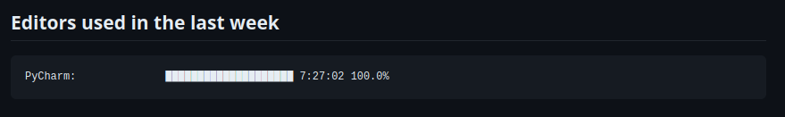

## Usage programming languages
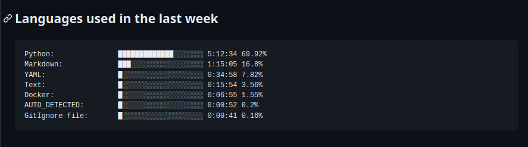

___


#  USAGE GIUDE
## 1. Create [wakatime](https://wakatime.com) account and add wakatime plugin to your IDE
### Example adding plugin in __PyCharm__

> settings --> plugins --> search 'wakatime'

[//]: # ( ![img.png]&#40;readme_images/pycharm_plugin.png&#41;)
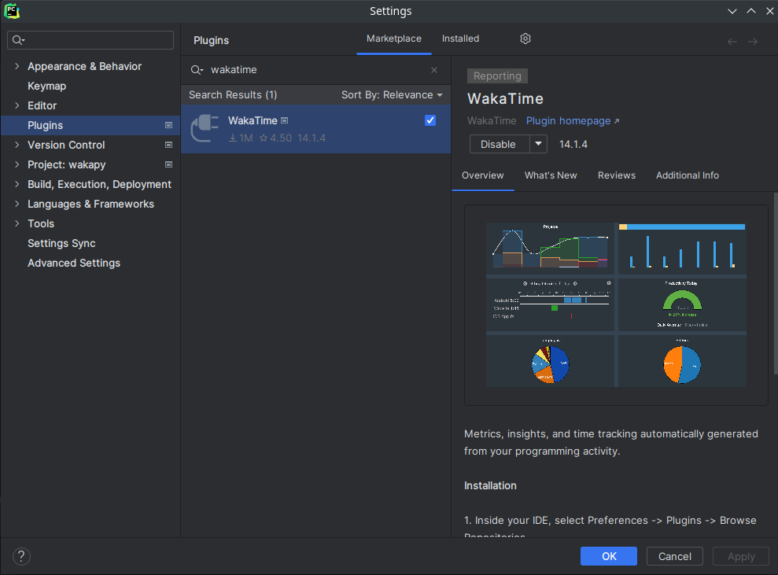

### After install plugin you need add __wakatime api key__ from [wakatime](https://wakatime.com) site to plugin
> If you did everything right, you will see this icon in the lower right corner in _JetBrains IDEs_

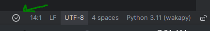


## 2. Create GitHub _secret_ Token

> Go to __settings__ --> __Developer settings__ -->
 
 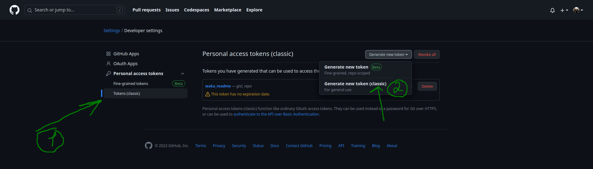
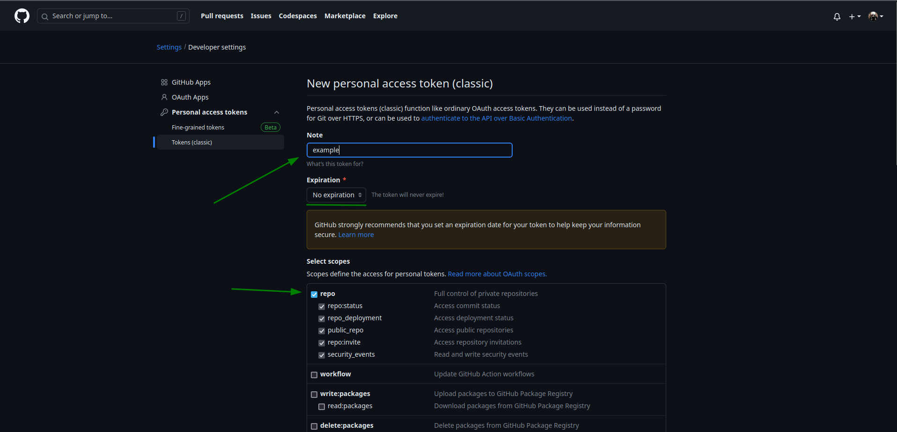

> Enter token name
> 
> Select expiration as 'No expiration'
> 
> Select 'repo' scope
> 
> Click 'Generate token' 


## 3. Create _action_ for your repository
### Create action

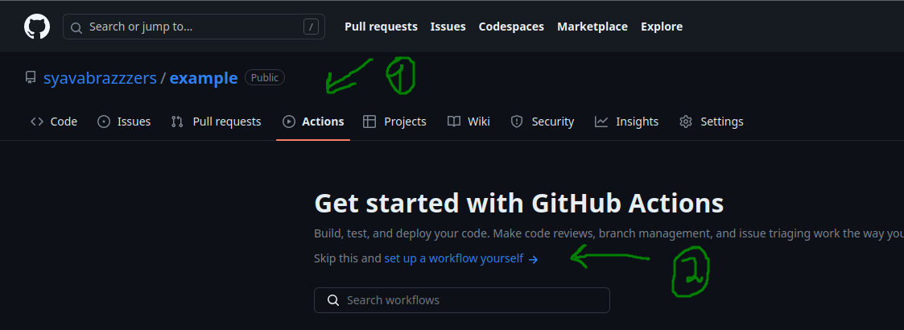

### Edit action

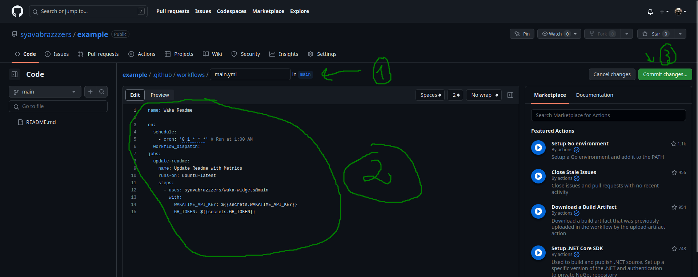


>1. Enter action file name (can be any)
>2. Write configuration for run action
>```yaml
>name: Waka Readme
>
>on:
>  schedule:
>    - cron: '0 1 * * *' # Run at 1:00 AM (you can edit it)
>  workflow_dispatch:
>jobs:
>  update-readme:
>    name: Update Readme with Metrics
>    runs-on: ubuntu-latest
>    steps:
>      - uses: syavabrazzzers/waka-widgets@main
>        with:
>          WAKATIME_API_KEY: ${{secrets.WAKATIME_API_KEY}}
>          GH_TOKEN: ${{secrets.GH_TOKEN}}
>```
>3. Commit changes


### Add secrets GitHub token and Wakatime API Key to action

> Add __GH_TOKEN__ and __WAKATIME_API_KEY__ secrets (___secret names need be like this___)

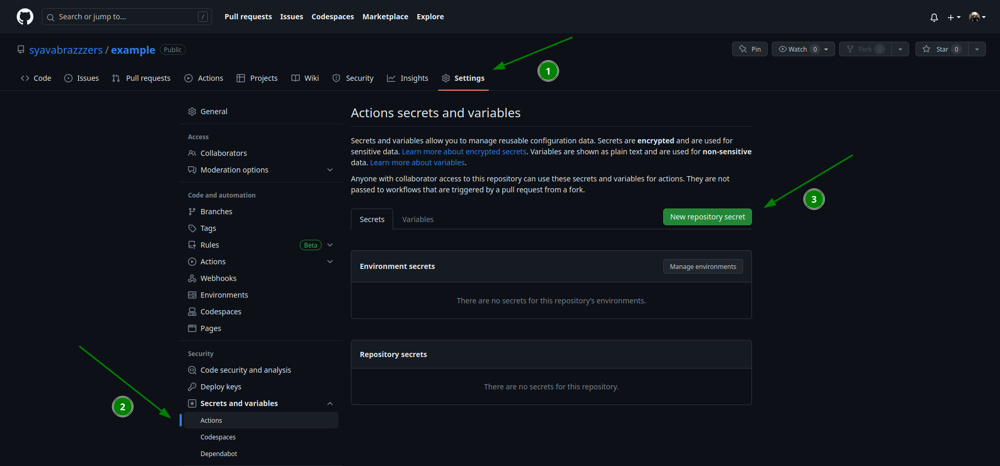

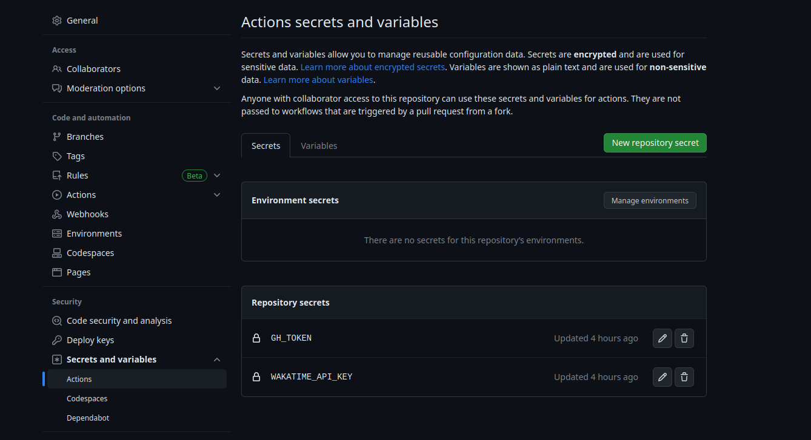


## 4. Edit README.md file

> Include this strings to your README.md file
> ```yaml
> 
> <!--START_SECTION:waka-->
> <!--END_SECTION:waka-->
> 
>```
> 
> Widgets will be created in this block


## Conclusion 

> And now, if you did everything right, your README will be updated daily at 1 am (if you did not change in the action file)
### But
#### You can force widget generation as follows

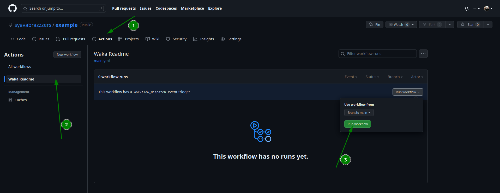
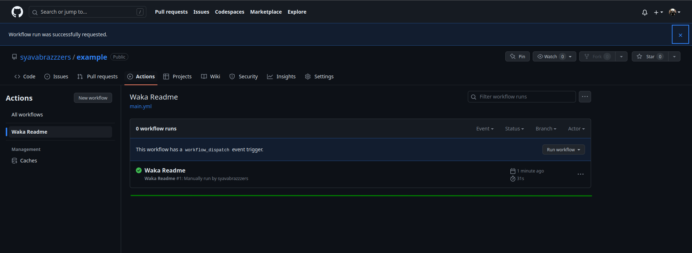